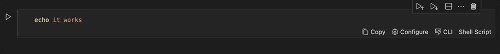
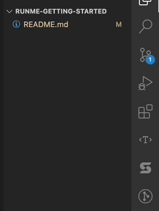
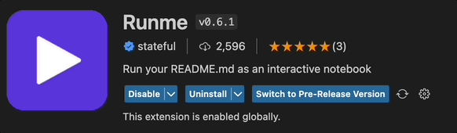
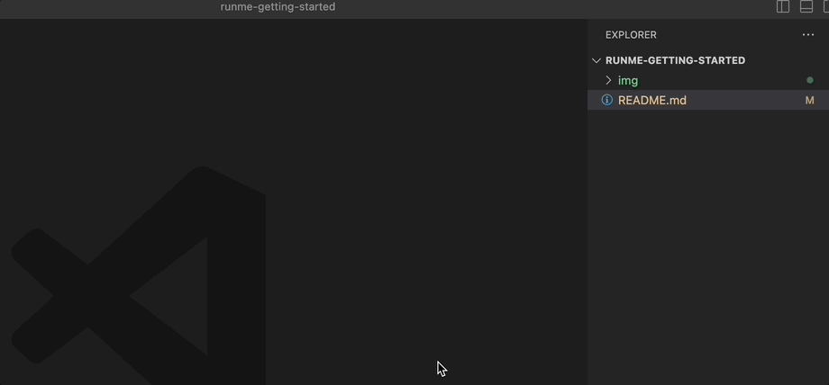
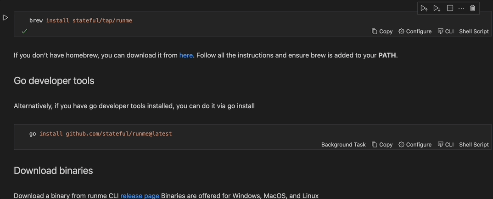

# Getting Started with Runme

## Introduction

A README file is like a compass that guides you in the right direction to reach the port safely. It generally helps developers to understand the HOW.

A well-written README can significantly impact your open-source project or reduce your employee's onboarding time for your private repositories. On the other hand, a poorly written README can affect the visibility of your project, even if you think it is an excellent piece of software.
For newcomers, it can quickly become a very frustrating experience.

We believe that even if you have an excellent README file, by encouraging your users to view it through the lens of RUNME, the experience will be a game changer.

**Let’s dig into why Runme is such an incredible experience:**

For newcomers, it’s the most user-friendly experience you will ever offer, and they won’t get confused about opening terminals and running commands. They will never wonder ever again, did I run that command before? RUNME will tell them already about that.

For experienced contributors to your project, README files become a standard reference guide they will use on their daily development flows. If they are more comfortable with terminals, they can use the RUNME cli. RUNME will become more sophisticated as time passes and help with more complex use cases.

**Copypasta menu is over.**

Have you ever wondered if there is a better way of doing READMEs and executing code blocks? It’s time for dessert, RUNME appears on the menu, and you can call it a day.



## How to Install the Extension?

Install the extension from within VS Code. Bring up the Extensions view by clicking on the Extensions icon in the Activity Bar on the side of VS Code, and search for runme.



A pre-release version is offered for curious developers who want to try our latest enhancements to the extension. Head to the extension configuration and click **Switch to Pre-release Version** to use it. If you don’t see such an option, ensure your VS Code is at least 1.63.0.



## How to ensure Runme is working properly?

It’s easy. Open your project README file and see it is now opened as a Notebook file! Check that shell commands are now rendered as runnable blocks. That’s pretty nice. Finally, you’re seeing the future of running your README files now. We bet you won’t want to return to plain markdown viewers.

## How to open a README file as markdown file?

Sometimes, you will want to see the file as a regular markdown file, and you don’t need to disable or uninstall RUNME. You can right-click on the file and pick one of the options displayed when clicking Open with. You can select the built-in text-editor or markdown preview for such cases.



## Getting the best of Runme

To get the best of runme, and to offer a fantastic README experience, RUNME has a cell configuration option, which allows you to indicate HOW the cell will be executed.
The cell represents an execution block, usually shell commands.

### Cell configuration options

| Configuration         | Description                                                    | Default value |
| ------------ | ---------------------------------------------------------------| ------------- |
|  background  | Indicates if the cell should be runned as a background process | false         |
|  interactive | Indicates if run should allow interactive input                | false         |
|  closeTerminalOnSuccess | Hide Terminal after cell successful execution       | true          |
|  mimeType    |  Cell’s output content MIME type                               | text/plain    |
|  name        | Cell’s canonical name useful for referencing the cell via CLI  | auto-generated |

## Mime types

Runme supports the standard VS Code mime types alongside custom Runme mime types.

### Standard VS Code mime types

- text/plain
- application/javascript
- text/html
- image/svg+xml
- text/markdown
- image/png
- image/jpeg

### Mime types for rendering code

- text/x-json
- text/x-javascript
- text/x-html
- text/x-rust
- text/x-LANGUAGE_ID for any other built-in or installed languages.

### Runme Mime types

- stateful.runme/vercel-stdout: Used for executing and rendering vercel commands
- stateful.runme/deno-stdout: Used for executing and rendering deno commands

### Specifying Cell Configuration options

You can use the RUNME editor to setup / edit the cell configuration options. Just localize the configuration option below the code block.



If you feel more comfortable editing the markdown file directly, you can do it by using the following configuration options schema:

    ```sh { interactive=false name=echo-hello-world }
    echo hello world
    ```

The entire configuration schema as an example

    ```sh { interactive=true name=example mimeType=text/plain closeTerminalOnSuccess=false background=false }
    echo hello world
    ```

Take a look at more [examples](https://github.com/stateful/vscode-runme/tree/main/examples) available inside the VS Code extension repo for a reference how to apply these code block attributes in different use-cases.

## Using the RUNME CLI

If you want to use RUNME outside VS Code, you can install the CLI as standalone application.

### MacOs

Install runme via Homebrew

```sh { name=brew-update }
brew update
```

```sh { name=brew-install-runme }
brew install stateful/tap/runme
```

If you don’t have homebrew, you can download it from [here](img/https://brew.sh/). Follow all the instructions and ensure brew is added to your **PATH**.

### Go developer tools

Alternatively, if you have go developer tools installed, you can do it via go install

```sh { name=install-runme-cli-via-go background=true closeTerminalOnSuccess=true }
go install github.com/stateful/runme@latest
```

If you don't have go developer tools installed and still want to use this method, [download and install go](https://go.dev/doc/install)

### Download binaries

Download a binary from runme CLI [release page](img/https://github.com/stateful/runme/releases)

Binaries are offered for Windows, MacOS, and Linux

#### Check the CLI is working

Once the CLI is installed, ensure you have a markdown file named **README.md** in the working directory you are running the CLI and run the following command:

```sh { name=check-runme closeTerminalOnSuccess=false }
runme fmt
```

You should see the markdown file contents from your working directory.
If you want to run the command against a different markdown file, you can use the **filename** flag in combination with **chdir** flag:

```sh { name=check-runme closeTerminalOnSuccess=false }
runme ls --filename SUPPORT.md --chdir ./.github
```

### RUNME usage

Let’s learn how to leverage **RUNME** powerful features to provide a fantastic **README** experience.
We will use [zx](https://github.com/google/zx), a powerful tool for writing complex scripts.

Node.js is required for running the following examples.

Check if Node.js is already installed by running

```sh { name=node-version closeTerminalOnSuccess=false }
node --version
```

Ensure you are running at least Node version >= 16.0.0

#### Installing Node.js

##### MacOS

Install using brew

```sh { name=install-node }
brew install node
```

Alternatively you can head to [Node.js download page](https://nodejs.org/en/)

Once Node.js is installed, install project dependencies by running the following command:

```sh { name=install-deps background=true }
npm i
```

Now we have all of our project dependencies installed, it's time to try some zx features.

### Get last git logs

```javascript
#!/usr/bin/env zx

let flags = [
    '--oneline',
    '--decorate',
    '--color',
  ]
await $`git log ${flags}`
```

```sh { name=run-demo closeTerminalOnSuccess=false interactive=false }
npx zx git-log.mjs
```

### Use node-fetch to get runme package dependencies

```javascript
#!/usr/bin/env zx

const req = await fetch('https://cdn.jsdelivr.net/gh/stateful/vscode-runme/package.json')
const { dependencies } = await req.json()
await $`echo The runme project has ${Object.keys(dependencies).length} dependencies`
```

```sh { name=run-demo closeTerminalOnSuccess=false interactive=false }
npx zx node-fetch.mjs
```

### Print current date

```javascript
#!/usr/bin/env zx

const date = await $`date`
await $`echo Current date is ${date}.`
```

```sh { name=run-demo closeTerminalOnSuccess=false interactive=false }
npx zx date.mjs
```
